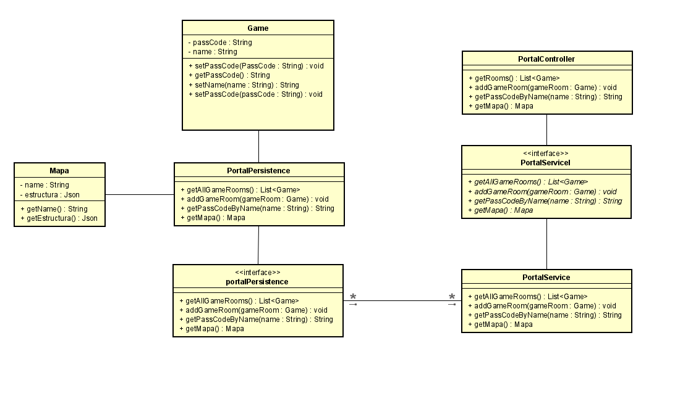
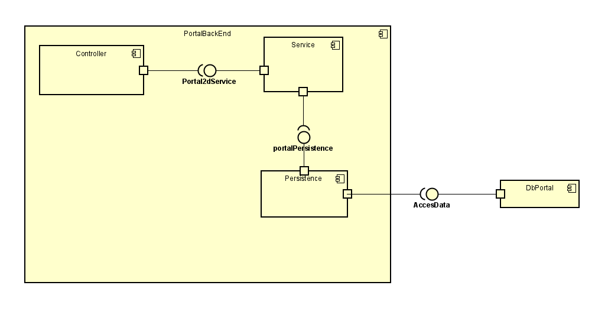

# Proyecto_Portal2D_ARSW
Proyecto portal 2d multijugador

## Integrantes
* Crhystian Camilo Molano Chacon
* Edward Daniel Porras Martin
* Johan Damian Garrido

## Resumen

Portal 2d es un juego de plataformas en tercera persona que consiste en superar una zona
con diferentes obstaculós, Para superar estos obstaculos cuenta con un arma capa de crear portales,
con diferentes obstaculos, Para superar estos obstaculos cuenta con un arma capa de crear portales,
para poder trasladar objetos o trasladarse de un portal a otro, esto de vuelve valioso ya que hay 
que crear o buscar la mejor forma de superar la zona.

## Descripción

Juego multijugador de plataformas en tercera persona donde se podrar jugar con otros jugadores.
Los jugadores tendran que superar una serie de escenarios en la menor cantidad de tiempo.

### Reglas de Juego

* Cada jugador inicia al mismo tiempo.
* Para completar las salas tendran un tiempo limite.
* Al completar las salas se les dara una puntuación dependiendo el tiempo que hallan tomado en completar la sala
* El jugador que no pueda completar la sala su puntuacion sera de 0.
* Se podra ver el progreso de los demas jugadores.

* ### Personaje principal
    Se mueve libremente por el mapa y cuenta con un arma capaz portales.
  
  

* ### Portales
    El juego tiene con dos tipos de portales uno azul y otro naranja estos permiten transladar 
objetos o transladarse de un portal a otro.
  
  

* ### Arma de portales
  El personaje principal posee un arma que le permite crear los portales, esta tambien posee una mira para saber de que color y en que ubicacion
  posicionar los portales.

   

  

* ### Obstaculos
  Esto busca que le jugar tenga que ubicar de manera estrategica los portales para poder superarlos

  

## HISTORIAS DE USUARIO

### Diagrama de casos de uso

### Diagra de clases BackEnd

### Diagrama de componentes

